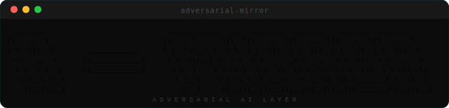

<div align="center">

**Terminal-first adversarial AI middleware. Classifies each prompt, routes open-ended questions<br>to two models in parallel, and synthesizes a verdict — all in real time.**


</div>

---

## The problem it solves

Every AI gives you the answer it thinks you want to hear. Adversarial Mirror sits between you and your models and routes the right prompts to a second model whose only job is to challenge the first one — not to be contrary, but to surface the assumptions you didn't know you were making, the risks you didn't ask about, and the alternatives you didn't consider.

Not every prompt benefits from adversarial pressure. Factual lookups, math, and code have correct answers — mirroring them wastes tokens and adds noise. Adversarial Mirror classifies each prompt first and only applies the challenger where it actually helps.

```
  Your prompt
      │
      ▼
  ┌──────────────────────────────────────────────────────┐
  │  Intent Classifier                                   │
  │                                                      │
  │  factual · math · code · conversational              │
  │    └─► direct mode  (original only, no challenger)   │
  │                                                      │
  │  opinion · analysis · strategy · prediction          │
  │    └─► mirror mode  (original + challenger)          │
  └──────────────────────────────────────────────────────┘
                          │
                          │ mirror mode
                          ▼
              ┌───────────────────────┐
              │  Original + Challenger│  both stream in parallel
              └───────────────────────┘
                          │
                          ▼
                      ┌───────┐
                      │ Judge │  agreement score · synthesis · blind spot
                      └───────┘  on by default — skip with --no-judge
```

The output is a persistent terminal session. Each completed exchange stamps itself permanently into the scrollback. Only the live streaming panels update while models are running.

---

## Install

```bash
npm install -g adversarial-mirror
```

Or build from source:

```bash
git clone https://github.com/ArtificialStephen/adversarial-mirror
cd adversarial-mirror
npm install && npm run build
npm link
```

Run the one-time setup wizard:

```bash
mirror config init
```

This walks you through API keys, default brains, intensity, judge, and persona settings. Keys are persisted to environment variables (`setx` on Windows, shell profile export on Unix).

---

## Quick start

```bash
# Interactive session (default when no subcommand is given)
mirror

# One-shot query — streams and exits
mirror mirror "Should I rewrite this in Rust?"

# Increase adversarial pressure
mirror --intensity aggressive

# Apply a professional lens to the challenger
mirror --persona security-auditor

# Disable the judge synthesis pass
mirror --no-judge

# Load a file as context before the session starts
mirror chat --file ./architecture.md

# One-shot with file context
mirror mirror --file ./spec.md "What are the risks?"

# Pipe anything in
cat proposal.md | mirror mirror "Challenge every assumption"

# Override which brains are used for this run
mirror --original claude-sonnet-4-6 --challenger o3-mini --judge-brain claude-opus-4-6
```

---

## How it works

### Intent classification

Before routing, the engine classifies the prompt to decide whether adversarial pressure will actually add value.

| Category | Routed to | Example |
|---|---|---|
| `factual_lookup` | Direct | "What year was Redis released?" |
| `math_computation` | Direct | "What is 17% of 4200?" |
| `code_task` | Direct | "Write a binary search in Go" |
| `conversational` | Direct | "Thanks, that helps" |
| `opinion_advice` | Mirror | "Should I use microservices?" |
| `analysis` | Mirror | "What are the risks of this approach?" |
| `prediction` | Mirror | "Will this scale to 10M users?" |
| `interpretation` | Mirror | "What does this contract clause mean?" |

Classification uses a small fast model (Claude Haiku by default) with a configurable confidence threshold. Prompts below threshold default to mirroring. Disable classification entirely with `--no-classify` to always mirror.

---

### Intensity levels

Controls how aggressively the challenger pushes back.

| Level | Style | Structure |
|---|---|---|
| `mild` | Gentle critic | Full answer + 1-2 real gaps + steelman alternative |
| `moderate` | Devil's advocate | Reframe / challenge the frame / hidden costs / strongest counterposition / verdict |
| `aggressive` | Full adversarial | Buried assumption / strongest refutation / failure cases / expert dissent / honest synthesis |

All levels enforce one rule: **every point must have a specific mechanism. Vague doubt is useless.**

```bash
mirror --intensity mild        # quick sanity check
mirror --intensity moderate    # default — the sweet spot
mirror --intensity aggressive  # when the stakes are high
```

---

### Persona lenses

Personas give the challenger a professional frame of reference. Instead of generic adversarialism, you get a domain expert's specific skepticism applied to your prompt. Personas stack on top of whatever intensity level is set.

| Persona | Lens | Focus areas |
|---|---|---|
| `vc-skeptic` | Investor | Market size assumptions, unit economics, moat, defensibility |
| `security-auditor` | Security & risk | Attack surfaces, trust boundaries, failure modes, blast radius |
| `end-user` | Real user | Actual behavior vs stated intent, adoption friction, miscomprehension |
| `regulator` | Compliance & legal | Regulatory exposure, liability, stakeholder harm, unintended consequences |
| `contrarian` | Pure opposition | Historical failures, second-order effects, inverted premises, consensus traps |

Personas and intensities are independent — you get 15 distinct challenger modes in total:

```bash
mirror --persona vc-skeptic --intensity aggressive
mirror --persona security-auditor                    # defaults to moderate
mirror --persona regulator --file ./terms.md chat
```

Set a default so you never have to type it:

```bash
mirror config set session.defaultPersona vc-skeptic
```

---

### Judge synthesis

After both models complete, a third model synthesizes their responses and produces a structured verdict:

```
AGREEMENT: 34%
Both models agree on the technical approach but diverge sharply on timeline and risk.

SYNTHESIS
The monolith wins short-term. The challenger's concern about coupling is real but premature
at your current scale. Revisit at 50k DAU. The original underestimates the ops cost of
distributed tracing — budget 2 sprints for observability before you ship anything.

BLIND SPOT
Neither model addressed the team's existing expertise. The "right" architecture is the one
your engineers can actually debug at 3am.
```

The agreement score gives you a quick read on how contested the territory is:

| Score | Meaning |
|---|---|
| 90-100% | Substantively identical — both models see the same thing |
| 70-89% | Same core answer, meaningful differences in emphasis or caveats |
| 50-69% | Partial overlap — worth reading both carefully |
| 30-49% | Different conclusions from shared premises |
| 0-29% | Fundamentally opposed — the question is genuinely hard |

```bash
mirror --no-judge                          # skip synthesis, go faster
mirror --judge-brain claude-opus-4-6       # use a heavier model for synthesis
mirror config set session.judgeBrainId o3-mini
```

---

### File and pipe input

Feed any document as context before a question.

```bash
# Interactive session with a file preloaded as context
mirror chat --file ./notes.md
mirror chat --file ./architecture.md

# One-shot with file context
mirror mirror --file ./contract.md "What clauses expose us to liability?"
mirror mirror --file ./codebase-summary.md "Where are the security risks?"

# Pipe from stdin
cat ./spec.md | mirror mirror "What are the weakest assumptions here?"
git diff HEAD~1 | mirror mirror "Review this diff for correctness and safety"
curl -s https://api.example.com/openapi.json | mirror mirror "What could go wrong with this API design?"
```

---

## Commands

```
mirror                                   Open interactive chat (default)
mirror chat                              Interactive multi-turn session
mirror chat --file <path>                Preload a file as conversation context

mirror mirror "<question>"               One-shot query, stream and exit
mirror mirror --file <path> "<question>" One-shot with file context

mirror config init                       Interactive setup wizard
mirror config show                       Print current config as JSON
mirror config set <key> <value>          Set a config value by dot-path

mirror brains list                       List configured brains
mirror brains test <id>                  Ping a brain to verify connection
mirror brains add                        Add a new brain interactively

mirror history list                      List saved sessions
mirror history show <id>                 Print a saved session as JSON
mirror history export <id> <file>        Export a session to a file
```

---

## Global flags

All flags apply to any command and can be freely combined:

```
--intensity mild|moderate|aggressive   Adversarial pressure level  (default: moderate)
--original <brain-id>                  Override the original brain
--challenger <brain-id>                Override the challenger brain
--judge-brain <brain-id>               Override the judge brain
--persona <name>                       Apply a professional lens to the challenger
--no-mirror                            Disable mirroring — original brain only
--no-classify                          Skip classification, always mirror
--no-judge                             Skip the judge synthesis pass
--debug                                Print debug info to stderr
```

---

## Configuration

Config is stored at:
- **macOS / Linux:** `~/.config/adversarial-mirror/config.json`
- **Windows:** `%APPDATA%\adversarial-mirror\config.json`

`mirror config init` sets everything up interactively. Set individual values with:

```bash
mirror config set session.defaultIntensity aggressive
mirror config set session.defaultPersona security-auditor
mirror config set session.originalBrainId claude-sonnet-4-6
mirror config set session.challengerBrainId o3-mini
mirror config set session.judgeEnabled false
mirror config set session.judgeBrainId claude-opus-4-6
mirror config set ui.showTokenCounts true
mirror config set ui.showLatency true
mirror config set ui.syntaxHighlighting true
```

View the full config at any time:

```bash
mirror config show
```

---

## Supported providers

Mix and match any provider for original, challenger, and judge independently.

| Provider | Example models | Env var |
|---|---|---|
| **Anthropic** | `claude-sonnet-4-6`, `claude-opus-4-6`, `claude-haiku-4-5-20251001` | `ANTHROPIC_API_KEY` |
| **OpenAI** | `gpt-4o`, `o3-mini`, `o3` | `OPENAI_API_KEY` |
| **Google** | `gemini-2.5-pro`, `gemini-1.5-pro` | `GOOGLE_API_KEY` |

Add a brain with `mirror brains add` or add it directly to the config:

```json
{
  "id": "my-o3",
  "provider": "openai",
  "model": "o3",
  "apiKeyEnvVar": "OPENAI_API_KEY"
}
```

A few combinations worth trying:

```bash
# Heavyweight — best quality, slower
mirror --original claude-opus-4-6 --challenger o3 --judge-brain claude-opus-4-6

# Fast and lean — no judge pass
mirror --original claude-sonnet-4-6 --challenger o3-mini --no-judge

# Cross-company sanity check
mirror --original claude-sonnet-4-6 --challenger gemini-2.5-pro
```

---

## Terminal UI

The interface is built with [Ink](https://github.com/vadimdemedes/ink) (React for terminals).

- **Completed exchanges** are stamped permanently to the scrollback via Ink's `Static` — they never flicker or redraw, even while the next query is streaming
- **Live panels** update as tokens arrive, batched at 60ms
- **Side-by-side layout** activates automatically at terminal widths >= 80 columns
- **Synthesis panel** appears below both brain panels with a yellow border when the judge is running
- **Syntax highlighting** in code blocks
- **Agreement score** shown in the synthesis panel header and status bar
- Token counts and latency visible with `mirror config set ui.showTokenCounts true`

```
Ctrl+C while idle       → exit
Ctrl+C while streaming  → cancel current request
```

---

## Development

```bash
git clone https://github.com/ArtificialStephen/adversarial-mirror
cd adversarial-mirror
npm install

npm run build          # compile to dist/
npm run dev            # watch mode
npm test               # 122 tests across 9 suites
npm run test:coverage  # coverage report
npm run test:watch     # vitest watch mode
```

Run without real API keys using the built-in mock adapter:

```bash
MOCK_BRAINS=true node dist/cli.js chat
MOCK_BRAINS=true node dist/cli.js --persona vc-skeptic mirror "my startup idea"
MOCK_BRAINS=true node dist/cli.js mirror --file README.md "What are the risks?"
echo "test input" | MOCK_BRAINS=true node dist/cli.js mirror "analyze this"
MOCK_BRAINS=true node dist/cli.js --no-judge --intensity aggressive chat
```

Build standalone binaries (no Node.js required to run):

```bash
npm run build && npm run package
# outputs to dist/pkg/ for:
#   win-x64 · linux-x64 · linux-arm64 · macos-x64 · macos-arm64
```

---

## License

MIT
